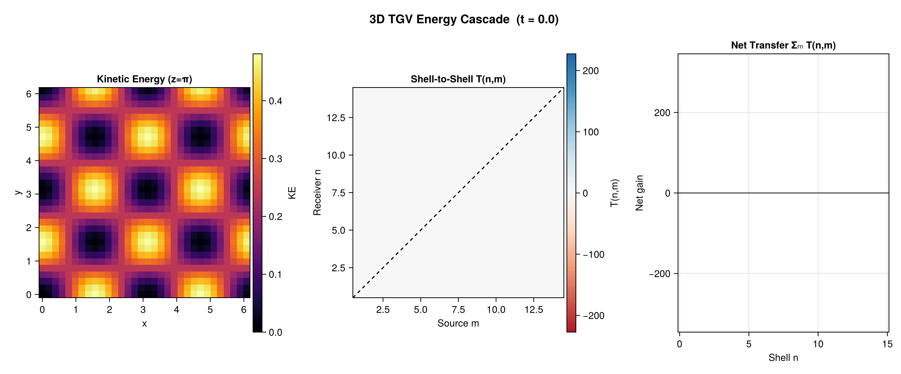

# FlowInvariantTransfer.jl

*Cross-scale transfer of quadratic inviscid invariants in turbulent flows — in Julia.*

[](https://github.com/jbphyswx/FlowInvariantTransfer.jl/actions/workflows/CI.yml)
[](https://jbphyswx.github.io/FlowInvariantTransfer.jl/dev/)

`FlowInvariantTransfer.jl` is a **general, domain-agnostic** toolkit for how quadratic inviscid
invariants move across scales in turbulence. At its core is one validated pseudospectral nonlinear
term `(u·∇)f` — the advection of *any* field `f` by *any* velocity `u` — wrapped in generic
reduction machinery (spectral flux → shell-to-shell → mode-to-mode → band-to-band), generic field
decompositions, anisotropic shell geometry, and a choice of exact dealiasing. It knows nothing
about a particular physical system, so it applies equally to homogeneous turbulence, atmosphere/
ocean flows, passive tracers, or abstract fields — and domain models (e.g. MHD) build *on top* of
it (see [`examples/mhd_on_top.jl`](examples/mhd_on_top.jl)).

The package works in **1D/2D/3D and N-D**, keeps the velocity-component count `D` decoupled from the
number of spatial dimensions `nd` (so 2D-3-component rotating/stratified flows are first-class), and
provides an allocating convenience API **and** zero-allocation `!`-variants for time-stepping loops.

---

## Diagnostics

| Method | Function | Output |
|--------|----------|--------|
| **Spectral flux** | `calculate_spectral_flux` | `T(k)`, `Π(K)` — transfer spectrum & cumulative flux |
| **Shell-to-shell** | `calculate_shell_to_shell_transfer` | `T(n,m)` — directed shell→shell transfer matrix |
| **Mode-to-mode** | `calculate_mode_to_mode_transfer` | resolved `S(k\|p)` — the finest triad object |
| **Smooth band-to-band** | `calculate_band_to_band_transfer` | `T(K,Q)` over graded (Eyink–Aluie) bands |
| **Partial fluxes** | `calculate_partial_fluxes` | per-component channels `Π^{s_k s_p s_q}(K)` |
| **Coarse-graining flux** | `calculate_coarse_graining_flux` | `Π_ℓ(x)` — pointwise flux at scale ℓ (via CGEF) |
| **Triadic Orthogonal Decomposition** | `triadic_orthogonal_decomposition` | mode bispectrum + coherent triad modes |

The reduction hierarchy is exact and consistent: `S(k|p)` sums over givers to `T(k)`, sums over
shells to `T(n,m)`, and cumulates to `Π(K)` — all verified to machine precision.

## Invariants

Switch the conserved quantity with `invariant=`; only the per-mode transfer density changes, not
the algorithm:

- `KineticEnergy()` (default), `Helicity()` (3D), `Enstrophy()` (2D conserved / 3D with stretching)
- `PassiveScalar()` — scalar variance `½⟨θ²⟩`, advected by the velocity. Convenience wrappers
  `calculate_scalar_flux` / `calculate_scalar_shell_to_shell_transfer` /
  `calculate_scalar_mode_to_mode_transfer`. The same path computes buoyancy/APE variance and QG
  potential enstrophy (pass that field as the scalar).

## Decompositions & partial fluxes

Split the velocity and resolve the flux by component:

- `HelmholtzDecomposition()` — rotational/divergent (via `HelmholtzDecomposition.jl`)
- `HelicalDecomposition()` — ±-helicity components (Waleffe/Alexakis √2 basis)
- `ToroidalPoloidalDecomposition()` — Craya–Herring vortical/wave split (rotating/stratified)
- `calculate_partial_fluxes(...; decomposition=...)` — the `n³` channels `Π^{s_k s_p s_q}(K)` for
  any 2-way split (the **helical 8-channel** homo/heterochiral fluxes, or the Helmholtz **rot↔div
  cross-flux**); `calculate_helical_partial_fluxes` is the helical shortcut.

## Shell geometry & dealiasing

- **Geometry** (`geometry=`): `IsotropicShells()` `|k|`, `PerpendicularShells()` `k⊥`,
  `ParallelShells()` `k∥` — the canonical anisotropic directional fluxes `Π(k⊥)`, `Π(k∥)`.
- **Binning**: `LinearBinning`, `LogarithmicBinning`, `DyadicBinning`, `CustomBinning`; smooth
  graded bands via `SmoothBands`.
- **Dealiasing** (`dealiasing=`): `OrszagTwoThirds()` (default), `NoDealiasing()`, or
  `PaddedThreeHalves()` — exact 3/2 zero-padding that retains every mode to Nyquist.

---

## Installation

```julia
using Pkg
Pkg.add("FlowInvariantTransfer")
```

The core is pure Julia (a dependency-free `DirectSumBackend` reference). Load `FFTW` for the
`O(N log N)` `FFTBackend` workhorse, and other packages to activate optional features (see below).

---

## Quickstart — spectral flux

```julia
using FlowInvariantTransfer, FFTW

N = 64; L = 2π
ks = wavenumber_grid((N, N), (L, L))
û  = randn(ComplexF64, N, N, 2)            # spectral velocity (ns..., D)

result = calculate_spectral_flux(û, ks;
    binning  = LinearBinning(2π / L),
    spectral = FFTBackend())               # transform backend (DirectSumBackend default)

result.k_shells           # shell-centre wavenumbers
result.transfer_spectrum  # T(k)
result.flux               # Π(K) — >0 forward cascade, <0 inverse
```

`spectral`/`execution` are the two orthogonal backend axes — e.g.
`execution = ThreadedBackend()` (load `OhMyThreads`) parallelizes the shell/mode loop while
`spectral = FFTBackend()` chooses the transform.

## Shell-to-shell

```julia
r = calculate_shell_to_shell_transfer(û, ks; binning=LinearBinning(2π/L), spectral=FFTBackend())
r.transfer_matrix          # T(n,m)
r.max_antisymmetry_error   # ≈ 0 for incompressible fields
```

## Mode-to-mode (resolved triads)

```julia
m = calculate_mode_to_mode_transfer(û, ks; spectral=FFTBackend())  # small grids: O(N^{2D})
m.net_transfer  # T(k) = Σ_p S(k|p)   (== the spectral transfer)
m.transfer      # S(k|p) — antisymmetric; shell-sums to T(n,m)
```

## Passive scalar

```julia
θ̂ = randn(ComplexF64, N, N)                # a scalar field (ns...) or (ns...,1)
sf = calculate_scalar_flux(û, θ̂, ks; binning=LinearBinning(2π/L), spectral=FFTBackend())
sf.flux        # Π_θ(K) — forward variance cascade; conserves (Σ T_θ ≈ 0)
```

## Anisotropic directional flux

```julia
Πperp = calculate_spectral_flux(û3, ks; binning=b, spectral=FFTBackend(),
                                geometry=PerpendicularShells())   # Π(k⊥)
```

## Helical partial fluxes (3D)

```julia
hp = calculate_helical_partial_fluxes(û3, ks; binning=b, spectral=FFTBackend())
hp.channels[(1,  1,  1)]   # homochiral (+++): inverse-cascade tendency
hp.channels[(1, -1,  1)]   # a heterochiral channel: forward
hp.total                   # Σ of the 8 channels == the full KE flux
```

## Exact 3/2 dealiasing

```julia
calculate_spectral_flux(û, ks; binning=b, spectral=FFTBackend(),
                        dealiasing=PaddedThreeHalves())   # exact to Nyquist
```

## Zero-allocation hot loop

```julia
ws = ShellToShellWorkspace(û, ks, LinearBinning(2π/L))
calculate_shell_to_shell_transfer!(result, ws, û, ks; spectral=FFTBackend())  # 0 allocs
```

---

## Examples

Runnable, figure-generating scripts (`julia --project=examples examples/<name>.jl`), all on
canonical *evolved* flows (Taylor–Green, ABC, 2D turbulence, Orszag–Tang) so the figures show real,
developed cascades:

`spectral_flux` · `shell_to_shell` · `mode_to_mode` · `passive_scalar` · `helical_flux` ·
`anisotropic_flux` · `triadic_orthogonal_decomposition` · `mhd_on_top` (a domain model built on the
public API).

### Example figure

Shell-to-shell `T(n,m)`, net transfer per shell, and a kinetic-energy slice for a **3D
Taylor–Green vortex** (N=32³, evolved to t≈5 by a pseudospectral Navier–Stokes solver). The
antisymmetric near-diagonal band and the low-shell-gain / high-shell-loss net transfer are the
canonical **forward energy cascade** of 3D turbulence.


Cascade development from t=0 to t=10:



---

## Backends

Two orthogonal axes that compose:

- **Spectral (transform):** `DirectSumBackend` (no deps) · `FFTBackend` (FFTW) · `NUFFTBackend`
  (FINUFFT) · `SHTBackend`/`NUFSHTBackend` (spherical).
- **Execution (parallelism):** `SerialBackend` · `ThreadedBackend` (OhMyThreads) ·
  `DistributedBackend` · `GPUBackend{B}` (KernelAbstractions).

| Diagnostic | Direct | FFT | Threaded | Distributed | GPU |
|-----------|:------:|:---:|:--------:|:-----------:|:---:|
| Spectral flux | ✓ | ✓ | ✓ | ✓ | ✓ |
| Shell-to-shell | ✓ | ✓ | ✓ | ✓ | ✓ |
| Mode-to-mode | ✓ | ✓ | ✓ | ✓ | ✓ |
| Band-to-band | ✓ | ✓ | ✓ | ✓ | ✓ |
| Partial fluxes | ✓ | ✓ | ✓ | ✓ | ✓ |
| TOD | ✓ | ✓ | ✓ | — | — |

(Diagnostics that delegate to the nonlinear-term engine inherit every backend; `PaddedThreeHalves`
dealiasing is FFT-only.)

### Extensions (loaded on demand)

| Extension trigger | Provides |
|---|---|
| `FFTW` | `O(N log N)` FFT transforms; exact 3/2 padding |
| `OhMyThreads` | threaded shell/mode/TOD loops |
| `Distributed` + `SharedArrays` | multi-process shell-to-shell |
| `KernelAbstractions` | GPU kernels |
| `HelmholtzDecomposition` | rotational/divergent decomposition |
| `CoarseGrainingEnergyFluxes` | pointwise coarse-graining flux `Π_ℓ(x)` |
| `FINUFFT` / `NUFSHT` / `FastSphericalHarmonics` | scattered-Cartesian / scattered-spherical / regular-spherical front-ends |
| `FlowFieldSpectra` | spectra integration |
| `CairoMakie` | plotting |

---

## See also

- [`THEORY.md`](THEORY.md) — sign conventions, normalizations, and references for every diagnostic.
- The `jbphyswx` flow ecosystem: spectra (`FlowFieldSpectra.jl`), the rotational/divergent solve
  (`HelmholtzDecomposition.jl`), and pointwise coarse-graining (`CoarseGrainingEnergyFluxes.jl`).

## References

- Verma et al. (2002) — *Local shell-to-shell energy transfer via nonlocal interactions* [arXiv:nlin/0204027](https://arxiv.org/abs/nlin/0204027)
- Alexakis, Mininni & Pouquet (2005) — *Imprint of large-scale flows on turbulence*, Phys. Rev. E 72
- Alexakis & Biferale (2018) — *Cascades and transitions in turbulent flows*, Phys. Rep. 767–769 [arXiv:1808.06186](https://arxiv.org/abs/1808.06186)
- Eyink & Aluie (2009) — *Localness of energy cascade in hydrodynamic turbulence*, Phys. Fluids 21
- Waleffe (1992); Biferale, Musacchio & Toschi (2012); Alexakis (2017) — helical decomposition & partial fluxes
- Yeung, Chu & Schmidt (2026) — *Triadic Orthogonal Decomposition*, J. Fluid Mech. 1031:A34
