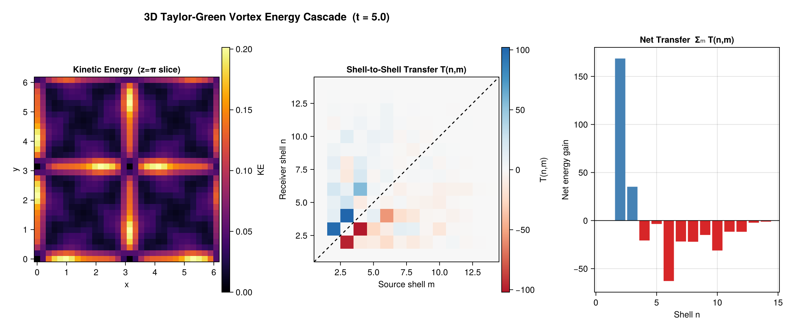

# FlowInvariantTransfer.jl

`FlowInvariantTransfer.jl` provides fast, minimally-allocating Julia implementations of
cross-scale transfer diagnostics for turbulent flow, supporting **multiple quadratic inviscid
invariants** (kinetic energy, helicity, enstrophy) and **partial-flux decompositions**
(Helmholtz rotational/divergent).

## Diagnostic Methods

| Method | Function | Output |
|--------|----------|--------|
| **Spectral flux** | [`calculate_spectral_flux`](@ref) | Π(K) — cumulative energy crossing wavenumber K |
| **Shell-to-shell** | [`calculate_shell_to_shell_transfer`](@ref) | T(n,m) — directed transfer from shell m to n |
| **Mode-to-mode triads** | [`calculate_mode_to_mode_transfer`](@ref) | S(k\|p\|q) — exact triad transfer |
| **Coarse-graining** | [`calculate_coarse_graining_flux`](@ref) | Π_ℓ(x) — pointwise flux at filter scale ℓ |
| **TOD** | [`triadic_orthogonal_decomposition`](@ref) | Mode bispectrum from temporal snapshots |

All methods support an allocating convenience API and a zero-allocation `!`-variant
with preallocated workspace structs.

---

## Installation

```julia
using Pkg
Pkg.add("FlowInvariantTransfer")
```

---

## Extension Architecture

The core package ships with a pure-Julia O(N²) direct-sum baseline requiring no compiled
dependencies. Load optional packages to activate fast paths and additional features:

| Extension | Trigger | Provides |
|-----------|---------|----------|
| FFTWExt | `using FFTW` | O(N log N) FFT fast path |
| OhMyThreadsExt | `using OhMyThreads` | Multi-threaded backends |
| DistributedExt | `using Distributed, SharedArrays` | Multi-process parallelism |
| KernelAbstractionsExt | `using KernelAbstractions` | GPU kernels (CUDA) |
| CGEFExt | `using CoarseGrainingEnergyFluxes` | Coarse-graining flux |
| HelmholtzDecompositionExt | `using HelmholtzDecomposition` | Rot/div partial fluxes |
| FINUFFTExt | `using FINUFFT` | Non-uniform FFT path |
| NUFSHTExt | `using NUFSHT` | Scattered spherical grids |
| FSHExt | `using FastSphericalHarmonics` | Regular spherical grids |
| FlowFieldSpectraExt | `using FlowFieldSpectra` | Spectral analysis integration |
| CairoMakieExt | `using CairoMakie` | Plotting recipes |

### Backend Support Matrix

| Diagnostic | Serial | FFT | Threaded | Distributed | GPU |
|-----------|--------|-----|----------|-------------|-----|
| Spectral flux | ✓ | ✓ | ✓ | — | — |
| Shell-to-shell | ✓ | ✓ | ✓ | ✓ | ✓ |
| Mode-to-mode triads | ✓ | — | ✓ | ✓ | ✓ |
| Coarse-graining | — | — | — | — | — |
| TOD | ✓ | ✓ | ✓ | — | — |

---

## Quickstart: Spectral Flux Π(K)

```julia
using FlowInvariantTransfer
using FFTW   # activates FFTBackend

N = 64; L = 2π
ks = wavenumber_grid((N, N), (L, L))

# Build a divergence-free velocity field from a streamfunction
ψ̂ = randn(ComplexF64, N, N)
û = zeros(ComplexF64, N, N, 2)
for ix in 1:N, iy in 1:N
    û[ix, iy, 1] =  im * ks[2][iy] * ψ̂[ix, iy]   # u =  ∂ψ/∂y
    û[ix, iy, 2] = -im * ks[1][ix] * ψ̂[ix, iy]   # v = -∂ψ/∂x
end

result = calculate_spectral_flux(û, ks;
    binning    = LinearBinning(2π / L),
    dealiasing = true,
    backend    = FFTBackend())

result.k_shells          # shell-centre wavenumbers
result.transfer_spectrum # T(k) — energy transfer rate per shell
result.flux              # Π(K) — cumulative energy flux
```

## Quickstart: Shell-to-Shell Transfer T(n, m)

```julia
result = calculate_shell_to_shell_transfer(û, ks;
    binning            = LinearBinning(2π / L),
    dealiasing         = true,
    verify_antisymmetry = true,
    backend            = FFTBackend())

result.transfer_matrix        # T(n,m) — N_sh × N_sh
result.net_transfer           # Σ_m T(n,m) per receiver shell
result.max_antisymmetry_error # max|T(n,m)+T(m,n)| — should be ≈ 0
```

## Quickstart: Mode-to-Mode Triads

```julia
# Exact triad transfer S(k|p|q) with shell reduction T(K,Q)
result = calculate_mode_to_mode_transfer(û, ks;
    binning   = LinearBinning(2π / L),
    invariant = KineticEnergy(),
    dealiasing = true)

result.net_transfer       # T(k) per mode
result.reductions.TKQ     # T(K,Q) — shell-reduced matrix
result.reductions.K       # shell-centre wavenumbers
```

## Quickstart: Multi-Invariant (Enstrophy)

```julia
# Compare kinetic energy vs enstrophy transfer on a 2D field
result_E = calculate_spectral_flux(û, ks;
    binning = LinearBinning(2π / L), invariant = KineticEnergy())

result_Ω = calculate_spectral_flux(û, ks;
    binning = LinearBinning(2π / L), invariant = Enstrophy())
# result_E.flux and result_Ω.flux show opposite cascade directions
```

## Quickstart: Helmholtz Partial Fluxes

```julia
using HelmholtzDecomposition  # loads the extension

# Rotational component only
result_rot = calculate_spectral_flux(û, ks;
    binning = LinearBinning(2π / L),
    decomposition = RotationalDecomposition())

# Full Helmholtz: returns NamedTuple with :rotational and :divergent
result_helm = calculate_spectral_flux(û, ks;
    binning = LinearBinning(2π / L),
    decomposition = HelmholtzDecomposition())
```

## Quickstart: Triadic Orthogonal Decomposition

```julia
using FlowInvariantTransfer
using FFTW  # activates FFTBackend for fast temporal DFTs

# 3D data array: (nt, nvar, nx)
nt, nvar, nx = 256, 1, 32
X = randn(nt, nvar, nx)

# Run TOD using the unified entry point
method = TriadicOrthogonalDecompositionMethod(nfft=64, noverlap=32, nmode=2)
result = calculate_energy_transfer(method, X; dt=0.01, backend=FFTBackend())

result.frequencies          # Shifted frequency axes
result.mode_bispectrum      # Singular values λ(fl, fn, mode)
result.modes                # Dict mapping (l, n) to mode NamedTuples
result.modal_energy_budget  # Energy transfer per triad per mode
```

## Zero-Alloc Hot-Loop Usage

Preallocate once, reuse every timestep:

```julia
ws     = ShellToShellWorkspace(û, ks, LinearBinning(2π / L))
result = calculate_shell_to_shell_transfer(û, ks; ...)  # first call

# inside time loop — zero heap allocation:
calculate_shell_to_shell_transfer!(result, ws, û_new, ks)
```

---

## Example Figure



---

## See Also

- [Methods & Theory](@ref) — mathematical background for each method
- [Architecture](@ref) — internal design and dispatch patterns
- [Backends & Extensions](@ref) — when to use each backend
- [API Reference](@ref) — full docstring index
